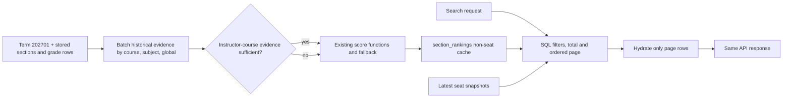

# Phase 7: MVP1-P4 Full-scale cache build and search performance — Research

**Researched:** 2026-09-22  
**Domain:** SQLAlchemy/PostgreSQL query profiling, ranking cache build, hosted Supabase latency  
**Confidence:** MEDIUM — the code paths and past measurements are verified, but no live database credentials are available in this research session.

## User Constraints

No Phase 7 `CONTEXT.md` exists. The user explicitly chose to continue from the roadmap and requirements and asked for research first. [VERIFIED: `.planning/ROADMAP.md:394-416`; user instruction in this planning session]

## Project Constraints (from AGENTS.md)

- Keep the existing historical easiness composition, Bayesian shrinkage, confidence labels, and course/instructor-course fallback unchanged. No scoring rewrite without explicit approval (D-02). [VERIFIED: `AGENTS.md:35-49`]
- Preserve term/CRN/source grade identity and deduplication; never commit raw grade exports. [VERIFIED: `AGENTS.md:45-51`]
- Seats, GenEd, modality, and syllabus signals must not affect scoring. A global prior with `effective_n = 0` is not course history. Report unavailable coverage honestly with source and date. [VERIFIED: `AGENTS.md:39-48`]
- Avoid broad USF crawling, AI features, accounts, and automatic registration. Verify `origin/main` by fetch before branch work. [VERIFIED: `AGENTS.md:48-53`]
- Keep `.planning/STATE.md` current after implementation; historical `docs/` proposals are not scope. [VERIFIED: `AGENTS.md:61-79`]

<phase_requirements>
## Phase Requirements

| ID | Description | Research Support |
|---|---|---|
| REQ-PERF-01 | Search page p95 below about 1.5 seconds on hosted Supabase at full Tampa coverage, with unchanged scoring and API contract and dated dataset/environment evidence. | Separate cache-build and serving measurements; profile count/page/hydration; plan-guided SQL/index tuning; run a read-only benchmark on the 3,783-row live term; preserve parity tests. [VERIFIED: `.planning/REQUIREMENTS.md`, REQ-PERF-01 section; `.planning/ROADMAP.md:394-416`] |
</phase_requirements>

## Summary

Phase 7 should begin with measured decomposition of both slow paths. The prior 3,782-section synthetic benchmark reported p95 2,397.90 ms, but its environment label used the optional `--url` argument and could falsely call a `DATABASE_URL` run “local Postgres.” The live hosted term now has 3,783 sections, 1,402 courses, and 179 historical grade rows confined to ten pilot courses. The Phase 6 whole-term quality pass took about 35 minutes. These are dated observations, not a fresh Phase 7 baseline. [VERIFIED: `.planning/phases/03.5-ranking-search-performance-at-full-coverage/03.5-PERF-REPORT.md`; `.planning/STATE.md`; `.planning/phases/06-mvp1-p3-all-tampa-section-ingestion-10-3-782/06-03-SUMMARY.md`]

The build path repeatedly loads and aggregates historical grades for every course, including the global aggregate, and then issues further per-section instructor, GenEd, and signal lookups. The serving path makes a count and page query over a latest-seat-snapshot window, then hydrates up to 200 rows. The high-value first steps are query-count/timing instrumentation and `EXPLAIN (ANALYZE, BUFFERS)` for representative count and page SQL. Optimize the measured dominant stage, checking result parity after each change. [VERIFIED: `src/easy_a/analytics/queries.py:46-78`; `src/easy_a/rankings/cache.py:73-190`; `src/easy_a/api/routes/rankings.py:69-191`; CITED: https://www.postgresql.org/docs/16/sql-explain.html]

**Primary recommendation:** Hoist historical grade reads/aggregates into one whole-term build context while preserving exact fallback semantics; then use PostgreSQL plans to tune the search count/page queries and add only indexes shown useful by the live workload. [VERIFIED: `src/easy_a/analytics/queries.py:46-78`; CITED: https://supabase.com/docs/guides/database/query-optimization]

## Architectural Responsibility Map

| Capability | Primary Tier | Secondary Tier | Rationale |
|---|---|---|---|
| Historical aggregate reuse during cache build | API/backend | Database/storage | The existing Python scoring and aggregation functions own semantics; SQL should deliver bounded source rows once. [VERIFIED: `src/easy_a/analytics/queries.py:46-78`] |
| Ranking cache persistence | Database/storage | API/backend | `section_rankings` persists non-seat ranking fields, and the refresh function builds them. [VERIFIED: `src/easy_a/rankings/cache.py:20-73`] |
| Search filters, sorting, count and page | Database/storage | API/backend | SQL performs filtering and pagination before API hydration. [VERIFIED: `src/easy_a/api/routes/rankings.py:69-191`] |
| Live seat freshness | API/backend | Database/storage | Seat snapshot state is joined at read time and hydrated separately from cached score. [VERIFIED: `src/easy_a/api/routes/rankings.py:69-191`; `src/easy_a/rankings/cache.py:194-269`] |
| Performance evidence | API/backend | Hosted database | The benchmark invokes the route function over the actual engine; hosted database plans reveal server time. [VERIFIED: `scripts/benchmark_rankings_search.py:196-231`; CITED: https://www.postgresql.org/docs/16/sql-explain.html] |

## Standard Stack

Use the repository's existing Python 3.12 target, SQLAlchemy 2.x, Alembic migrations, psycopg 3, PostgreSQL 16, and pytest; no new package is needed. The `pyproject.toml` dependency floors are `"sqlalchemy>=2.0.0"`, `"psycopg[binary]>=3.2.0"`, and `"pytest>=8.3.0"`; these are the declared floors, not claims about newest registry versions. [VERIFIED: `pyproject.toml:10-26`; `.planning/PROJECT.md:1-18`]

| Component | Use | Why |
|---|---|---|
| SQLAlchemy Core/ORM 2.x | Existing query composition and session/engine events | Retains API and transaction behavior. [VERIFIED: `src/easy_a/api/routes/rankings.py:1-20`; `src/easy_a/db.py:1-50`] |
| Alembic | Add any justified composite/seat-snapshot index in a checked-in migration | Hosted Supabase currently has migration `0003_create_section_rankings`; new schema work needs reproducibility. [VERIFIED: `migrations/versions/0003_create_section_rankings.py:1-65`; `.planning/STATE.md`] |
| PostgreSQL `EXPLAIN (ANALYZE, BUFFERS)` | Measure actual plan nodes, rows, loops, and buffer use | PostgreSQL documents the measured execution plan and I/O counts. [CITED: https://www.postgresql.org/docs/16/sql-explain.html] |
| `time.perf_counter()` | Wall-clock timings for end-to-end and build stages | Already used by the benchmark, so comparisons can share the same timer. [VERIFIED: `scripts/benchmark_rankings_search.py:196-231`] |

**Package legitimacy audit:** no external package installation is recommended. Therefore registry/version checks and package-legitimacy gates do not apply to this phase. [VERIFIED: `pyproject.toml:10-26`; research recommendation]

## Architecture Patterns



The diagram follows current boundaries: cache stores non-seat fields, while search joins latest seat snapshots and hydrates page rows. [VERIFIED: `src/easy_a/rankings/cache.py:20-70`; `src/easy_a/api/routes/rankings.py:69-191`]

### Pattern 1: Measure the query count and wall time per stage

At execution, first capture a live baseline: stored section and cache row counts, whole-term rebuild wall time, SQL statement count, grade aggregate reads, count-query time, page-query time, hydration time, and end-to-end p50/p95/max. Run `EXPLAIN (ANALYZE, BUFFERS)` on representative count and page statements before choosing an index. Report both in-process `search_rankings()` timing (diagnosis) and HTTP `GET /api/v1/rankings/search` response timing (the user-visible API gate), against the same hosted Supabase dataset and query mix. An HTTP call to a locally served API includes routing and serialization but does not measure a future deployment host or browser network path; label that limit precisely. Keep credentials and raw grade rows out of logs. These are execution decisions, not measured Phase 7 results. [VERIFIED: `src/easy_a/analytics/queries.py:46-78`; `src/easy_a/api/routes/rankings.py:52-191`; `.planning/phases/03.5-ranking-search-performance-at-full-coverage/03.5-PERF-REPORT.md`; CITED: https://www.postgresql.org/docs/16/sql-explain.html]

### Pattern 2: Hoist shared historical evidence without changing score math

For one target term, fetch historical grade observations with the same pre-term predicate, dedup/source selection, course attribution `OR` logic, and instructor mapping as the current helpers. Build reusable per-course and global inputs, then derive the subject prior **excluding the current course** before calling the existing `_stats_with_course_subject_global_fallback` and `compute_historical_outcome_stats`. Do not replace weighted aggregates with simple subtraction unless equivalence is proved: `aggregate_grade_observations` applies recency and evidence logic. Instructor-course fallback must remain conditioned on the current sufficiency check. [VERIFIED: `src/easy_a/analytics/queries.py:46-330`; `src/easy_a/analytics/grades.py`; `src/easy_a/analytics/scoring.py`]

An internal batch API may share prefetched observations between `refresh_section_rankings` and `_check_analytics`; retain the public per-course functions for on-demand ranking paths. Validate exact returned scores, score source, prior level, confidence, counts, and provenance against the existing implementation for both populated and empty courses. [VERIFIED: `src/easy_a/rankings/cache.py:73-190`; `src/easy_a/quality/checks.py:431-472`; `tests/rankings/test_cache_parity.py:31-95`]

### Pattern 3: Tune count and page SQL independently

The current `filtered` selectable includes a windowed latest-snapshot subquery and wide JSON cache columns, then is reused for both `COUNT(*)` and paged retrieval. A count path can avoid payload columns and avoid the latest-snapshot join when `seats_open` is false; a page path can fetch section IDs under the filter/order, then hydrate full cached payloads for those IDs. These are candidate refactors to validate against `EXPLAIN`, supported sorts, filters, tie breaks, pagination, and live seat updates. [VERIFIED: `src/easy_a/api/routes/rankings.py:69-191`; `tests/api/test_rankings_search_sql.py:65-209`]

When latest-seat lookup dominates, test a per-section latest-row lookup with a matching `(section_id, observed_at DESC, id DESC)` index against the current whole-table `row_number()` window. The index and rewrite are conditional on an observed plan improvement; a full-scan window may still win for broad all-term requests. PostgreSQL's planner chooses by real row counts and statistics. [VERIFIED: `src/easy_a/api/routes/rankings.py:69-109`; CITED: https://www.postgresql.org/docs/16/using-explain.html; CITED: https://supabase.com/docs/guides/database/query-optimization]

### Pattern 4: Use measured composite indexes

Existing migration 0003 creates six single-column cache indexes: `"easiness_score"`, `"smoothed_withdrawal_rate"`, `"confidence_label"`, `"subject"`, `"course_number"`, and `"delivery_method"`. Test term-led composite indexes for the common filter/sort paths and an index matching the chosen latest-seat access path; choose and keep only those that improve actual plans and p95. A multicolumn B-tree is most effective when predicates constrain leading columns; a matching `ORDER BY ... LIMIT` can avoid sorting all rows. New indexes increase rebuild write cost, so measure both serve and build. [VERIFIED: `migrations/versions/0003_create_section_rankings.py:47-63`; CITED: https://www.postgresql.org/docs/16/indexes-multicolumn.html; CITED: https://www.postgresql.org/docs/16/indexes-ordering.html; CITED: https://supabase.com/docs/guides/database/query-optimization]

### Pattern 5: Benchmark live coverage and label it correctly

The existing harness seeds a synthetic fixture in a throwaway schema and rolls it back. Keep that mode for repeatable regression comparisons, but add a separate read-only mode that times the committed live 202701 cache at the actual 3,783-section scale. Use the current harness's deterministic query matrix: first six configured subjects; every third request has a subject filter; every fourth has `seats_open`; every sixth has `min_easiness=3.0`; cycle all five supported sorts (`"easiness_desc"`, `"easiness_asc"`, `"withdrawal_asc"`, `"seats_desc"`, `"course"`), `limit=50`, and offsets `0, 50, 100, 150, 200`. Quote: `sorts = list(RankingSort)` and `sort=sorts[i % len(sorts)]`; enum values are quoted verbatim from `src/easy_a/api/schemas.py:10-15`. Warm up with at least one complete five-sort cycle, then collect at least 50 measured calls for both in-process and HTTP modes and report each mode separately. Report whether the target is hosted Supabase from `engine.url` properties, not the optional `--url` argument, and never print the URL or credentials. `engine.url.host` and `engine.url.port` are available as properties; SQLAlchemy documents URL password obfuscation. Do not claim Supabase merely from a long seed time. [VERIFIED: `scripts/benchmark_rankings_search.py:1-24,149-231,370-390,392-435`; `src/easy_a/api/schemas.py:10-15`; `.planning/phases/03.5-ranking-search-performance-at-full-coverage/03.5-PERF-REPORT.md`; CITED: https://docs.sqlalchemy.org/en/20/core/engines.html]

## Don't Hand-Roll

| Problem | Use instead | Reason |
|---|---|---|
| Score recomputation | Existing grade aggregation, scoring, confidence, and fallback functions | Preserves the frozen methodology and byte-for-byte parity. [VERIFIED: `src/easy_a/analytics/queries.py:46-205`; `tests/rankings/test_cache_parity.py:31-95`] |
| Query plan guessing | PostgreSQL `EXPLAIN (ANALYZE, BUFFERS)` on count and page SQL | Actual rows, loops, scans, and buffers reveal bottlenecks. [CITED: https://www.postgresql.org/docs/16/sql-explain.html] |
| Untracked ad hoc database indexes | Alembic migration | Repeatable schema state for hosted Supabase. [VERIFIED: `migrations/versions/0003_create_section_rankings.py`] |
| A replacement benchmark statistics library | Existing percentile and timer helpers | Existing harness already computes p50/p95/max. [VERIFIED: `scripts/benchmark_rankings_search.py:392-449`] |

## Runtime State Inventory

This phase optimizes/refactors running code and may add indexes, but does not rename keys or move persisted identities. The live hosted database is the runtime state that matters. [VERIFIED: `.planning/ROADMAP.md:394-416`]

| Category | Items found | Action required |
|---|---|---|
| Stored data | Live `section_rankings` cache and current seat snapshots at the hosted term. [VERIFIED: `.planning/STATE.md`; `src/easy_a/rankings/cache.py:20-73`] | Rebuild cache after code change; preserve transactional safety and check exact row count/parity. |
| Live service config | Hosted Supabase connection target is supplied by `DATABASE_URL` through settings. [VERIFIED: `src/easy_a/db.py:34-43`; `scripts/benchmark_rankings_search.py:1-24`] | No rename; verify actual engine URL properties privately for benchmark labeling. |
| OS-registered state | No name/registration change is in Phase 7 scope. [VERIFIED: `.planning/ROADMAP.md:394-416`] | None. |
| Secrets/env vars | `DATABASE_URL` and optional `EASY_A_TEST_POSTGRES_URL` are used by existing code/tests; neither is set in this research process. [VERIFIED: `scripts/benchmark_rankings_search.py:1-24`; `tests/refresh/test_postgres_coverage.py`; environment probe 2026-09-22] | Never print or commit values; live run requires operator-provided environment. |
| Build artifacts | Existing local `.venv` supports `uv`; no package/module rename planned. [VERIFIED: environment probe 2026-09-22] | No package reinstall planned. |

## Common Pitfalls

1. **Faster build, changed score:** A subject prior currently excludes the course being scored, and grade rows can match by attributed course ID or historical section course ID. Grouping solely on `GradeDistribution.course_id` or using a subject total that includes the course changes scores. Compare the full cache payload and historical summary, not only `easiness_score`. [VERIFIED: `src/easy_a/analytics/queries.py:46-78,215-270`; `tests/rankings/test_cache_parity.py:31-95`]
2. **Fast SQL, slow API:** `EXPLAIN` excludes client/server network transfer, Python deserialization, Pydantic hydration, and two query round trips. Measure request wall time as the acceptance metric and plan time as diagnosis. [VERIFIED: `src/easy_a/api/routes/rankings.py:166-191`; CITED: https://www.postgresql.org/docs/16/using-explain.html]
3. **Count/page inconsistency:** Simplifying count filters can change totals if `gened_code` or `seats_open` is omitted; seat sorting must use latest seats before pagination. Existing tests cover filters, sorts, ties, and complete paging; expand for any new split-query implementation. [VERIFIED: `src/easy_a/api/routes/rankings.py:107-191`; `tests/api/test_rankings_search_sql.py:65-209`]
4. **Misleading benchmark environment:** `url=None` currently forces `pooler=False` and a `local Postgres` label even when `get_engine()` resolved `DATABASE_URL` to Supabase. Read only the resolved engine URL host/port and report a sanitized classification. [VERIFIED: `scripts/benchmark_rankings_search.py:165-185,392-435`]
5. **Over-indexing:** Six single-column cache indexes already exist; extra indexes add refresh writes and may be ignored by the planner. Use before/after plans and timings, and run `ANALYZE` after large data changes if statistics are stale. [VERIFIED: `migrations/versions/0003_create_section_rankings.py:47-63`; CITED: https://supabase.com/docs/guides/database/query-optimization; CITED: https://www.postgresql.org/docs/16/sql-analyze.html]
6. **Conflating performance with grade coverage:** Only ten pilot courses currently have historical rows. New courses legitimately carry `effective_n = 0` and `score_source=global`; a faster cache rebuild must keep that explicit state. Historical imports for the remaining courses are separate work. [VERIFIED: `.planning/STATE.md`; `.planning/phases/06-mvp1-p3-all-tampa-section-ingestion-10-3-782/06-03-SUMMARY.md`]

## Code Examples

The SQL below is diagnostic pseudocode, not a proposed migration. Run it against the exact compiled count and page statements with representative bound values; do not embed secret URLs or grade rows in the report. PostgreSQL 16 documents both options. [CITED: https://www.postgresql.org/docs/16/sql-explain.html]

```sql
EXPLAIN (ANALYZE, BUFFERS, FORMAT JSON)
SELECT ...;
```

For the benchmark label, inspect `engine.url.host` and `engine.url.port` and classify the known Supabase host pattern or pooler port; output only the classification and dialect. Avoid `engine.url.render_as_string(hide_password=False)`. [VERIFIED: `src/easy_a/db.py:25-43`; CITED: https://docs.sqlalchemy.org/en/20/core/engines.html]

## State of the Art

The repository already replaced the old per-section N+1 search with SQL count plus page queries and a derived `section_rankings` cache. The remaining Phase 7 work is observed performance tuning and full-scale cache construction, not another scoring model or API redesign. [VERIFIED: `.planning/phases/03.5-ranking-search-performance-at-full-coverage/03.5-PERF-REPORT.md`; `.planning/ROADMAP.md:394-416`]

## Assumptions Log

| # | Claim | Section | Risk if wrong |
|---|---|---|---|
| A1 | [ASSUMED] A per-section latest-seat lookup will outperform the present window at live scale. | Architecture Patterns | Incorrect index/query work; require plan and wall-clock proof before adopting. |
| A2 | [ASSUMED] The shared grade-aggregate reads are the dominant cache-build cost rather than instructor/signal/GenEd per-section queries. | Architecture Patterns | Optimize wrong stage; instrument first. |
| A3 | [ASSUMED] The existing deterministic benchmark mix adequately represents future production traffic. | Validation Architecture | Passing the fixed gate may miss a different real usage pattern; record its exact mix and treat future traffic analysis separately. |

## Open Questions (RESOLVED)

1. **Stage split:** At execution, time the count SQL, page SQL, hydration, full in-process route, and HTTP API response separately; run `EXPLAIN (ANALYZE, BUFFERS)` for representative count and page queries before selecting an index. The HTTP p95 is the acceptance gate; in-process and SQL timings diagnose it. No live stage values were available to this researcher. [VERIFIED: `src/easy_a/api/routes/rankings.py:52-191`; environment probe 2026-09-22; CITED: https://www.postgresql.org/docs/16/sql-explain.html]
2. **Cache completeness/build:** At execution, count 202701 sections and matching `section_rankings` rows, compare IDs for missing/extra rows, then time a whole-term rebuild and check count/parity again. Phase 6's reconciliation is prior evidence, not a fresh rebuild-time measurement. [VERIFIED: `.planning/phases/06-mvp1-p3-all-tampa-section-ingestion-10-3-782/06-03-SUMMARY.md`; `src/easy_a/rankings/cache.py:73-190`]
3. **Fixed p95 workload:** Use the deterministic matrix in Pattern 5 over actual live 202701 data; include broad and subject-filtered requests, seat/no-seat requests, every supported sort, a five-sort warmup, and at least 50 measured HTTP calls plus 50 separately reported in-process calls. Record the observed live section count (3,783 as of 2026-09-22), date, environment, p50/p95/max, and any failed calls. The locally served HTTP API measurement excludes browser and eventual deployment-host latency; state that limitation with the result. [VERIFIED: `scripts/benchmark_rankings_search.py:370-390`; `src/easy_a/api/schemas.py:10-15`; `.planning/STATE.md`]

## Environment Availability

| Dependency | Required by | Available here | Version/observation | Fallback |
|---|---|---|---|---|
| `uv` | Python tests and scripts | Yes | 0.11.1 on 2026-09-22 | — |
| Python environment | Backend | Yes | `uv run python` 3.14.0 here, while project specifies Python 3.12 target. [VERIFIED: environment probe; `AGENTS.md:16-22`] | Use project-compatible interpreter for final gates if version-sensitive. |
| PostgreSQL/Supabase credentials | Live EXPLAIN and p95 | No | `DATABASE_URL` and `EASY_A_TEST_POSTGRES_URL` absent in this process; values were not inspected. | Planner can implement and test locally, but live acceptance needs the configured hosted connection. |
| `psql` | Optional manual EXPLAIN | No executable resolved in this shell | 2026-09-22 probe | Execute parameterized SQL through existing SQLAlchemy engine. |

## Validation Architecture

The phase has no `.planning/config.json` specifying `workflow.nyquist_validation=false`, so include validation planning by default. [VERIFIED: filesystem check 2026-09-22]

| Property | Value |
|---|---|
| Framework | pytest, declared `>=8.3.0`. [VERIFIED: `pyproject.toml:26`] |
| Quick run | `uv run pytest tests/rankings/test_cache_parity.py tests/api/test_rankings_search_sql.py tests/refresh/test_rankings_cache_refresh.py -q` |
| Full run | `uv run pytest -q` plus PostgreSQL integration with `EASY_A_TEST_POSTGRES_URL` when configured. [VERIFIED: `.planning/STATE.md`; `tests/refresh/test_postgres_coverage.py`] |

| Requirement | Behavior | Test/evidence |
|---|---|---|
| REQ-PERF-01 | Cache fields equal on-demand results for course-backed, subject/global fallback, and instructor cases | Extend `tests/rankings/test_cache_parity.py`; run targeted pytest. [VERIFIED: `tests/rankings/test_cache_parity.py`] |
| REQ-PERF-01 | Search filter/order/count/pagination/seat behavior unchanged | Extend `tests/api/test_rankings_search_sql.py`, especially all filters and sort/tie cases. [VERIFIED: `tests/api/test_rankings_search_sql.py:65-209`] |
| REQ-PERF-01 | Correct sanitized environment label for `DATABASE_URL` and explicit URL | Add focused benchmark tests with fake `Engine.url`; no actual credentials. [VERIFIED: `scripts/benchmark_rankings_search.py:392-435`] |
| REQ-PERF-01 | User-visible HTTP search API p95 below about 1.5 seconds at real scale | Dated read-only HTTP `GET /api/v1/rankings/search` benchmark through a locally served API connected to hosted Supabase, at least 50 measured calls after a five-sort warmup; report exact live row count, fixed query mix, p50/p95/max, failures, and sanitized environment. Separately report in-process route timing and SQL stage timings. State that deployment-host/browser network latency is outside this gate. [VERIFIED: `.planning/ROADMAP.md:394-416`; `scripts/benchmark_rankings_search.py:370-390`] |

**Wave 0 gaps:** tests for batched analytics parity/query counts, environment label from a resolved engine, and any split count/page SQL do not yet exist. Add these with implementation; keep the synthetic fixture regression test and add the live read-only measurement mode. [VERIFIED: `tests/rankings/test_cache_parity.py`; `tests/api/test_rankings_search_sql.py`; `scripts/benchmark_rankings_search.py`]

## Security Domain

No auth or session feature is being added. For this read-only search path, ASVS input validation and data handling are relevant: FastAPI query bounds and SQLAlchemy bound statements remain in place; URL credentials must never appear in benchmark output. The write-side cache rebuild should retain caller-controlled transaction boundaries. [VERIFIED: `AGENTS.md:48-53`; `src/easy_a/api/routes/rankings.py:52-67`; `src/easy_a/rankings/cache.py:73-80`; `scripts/benchmark_rankings_search.py:1-24`]

| ASVS category | Applies | Control |
|---|---|---|
| V2 Authentication / V3 Session / V4 Access Control | No new mechanism | Keep current API contract; no accounts in scope. [VERIFIED: `AGENTS.md:48-53`] |
| V5 Input Validation | Yes | Preserve typed/bounded `term`, filters, `limit`, `offset`; parameterized SQLAlchemy expressions. [VERIFIED: `src/easy_a/api/routes/rankings.py:52-67,107-151`] |
| V6 Cryptography | No custom crypto | Do not handle or print credential values in diagnostic reports. [VERIFIED: `scripts/benchmark_rankings_search.py:1-24`] |

Potential threats are leaked database credentials in labels/diagnostics and excessive queries under unbounded search. Output only sanitized dialect/host class, keep query bounds, and avoid logging raw grade records. [VERIFIED: `scripts/benchmark_rankings_search.py:1-24`; `src/easy_a/api/routes/rankings.py:52-67`; `AGENTS.md:45-51`]

## Sources

**Primary repo evidence:** `AGENTS.md`, `.planning/STATE.md`, `.planning/PROJECT.md`, `.planning/ROADMAP.md`, `.planning/REQUIREMENTS.md`, Phase 03.5 performance report, Phase 06 summaries, current analytics/cache/search/benchmark source, migration 0003, and existing parity/search tests (opened 2026-09-22).

**Official documentation:** [PostgreSQL 16 EXPLAIN](https://www.postgresql.org/docs/16/sql-explain.html); [PostgreSQL 16 using EXPLAIN](https://www.postgresql.org/docs/16/using-explain.html); [PostgreSQL 16 multicolumn indexes](https://www.postgresql.org/docs/16/indexes-multicolumn.html); [PostgreSQL 16 indexes and ordering](https://www.postgresql.org/docs/16/indexes-ordering.html); [PostgreSQL 16 ANALYZE](https://www.postgresql.org/docs/16/sql-analyze.html); [Supabase query optimization](https://supabase.com/docs/guides/database/query-optimization); [SQLAlchemy engine configuration](https://docs.sqlalchemy.org/en/20/core/engines.html).

**Confidence breakdown:** stack HIGH (existing repo declarations); architecture MEDIUM (source path inspected, live plan unavailable); pitfalls HIGH for known semantics and benchmark bug, MEDIUM for proposed query/index improvements. **Valid until:** 2026-10-22 for code shape; refresh live counts and plans at execution time.
